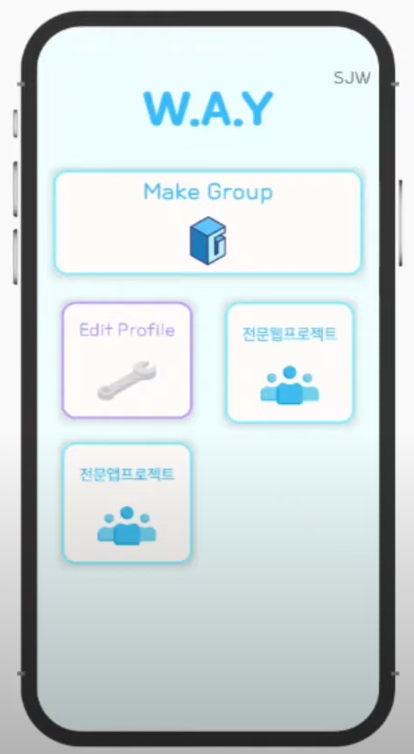
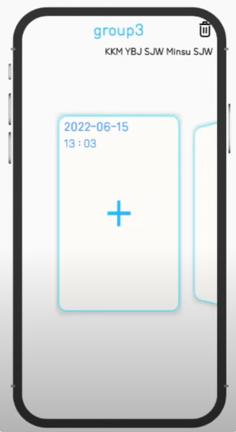
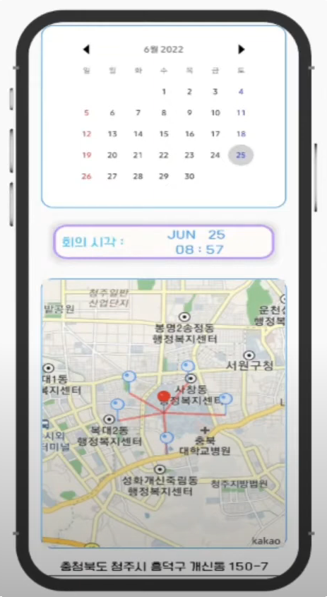
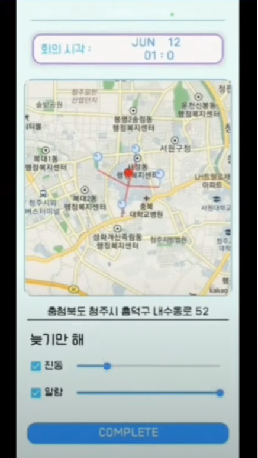
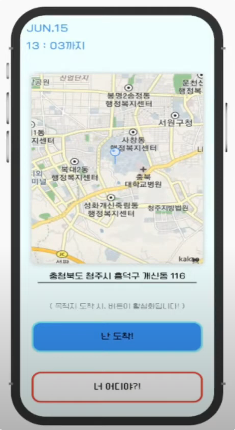

# Where You At? : WAY
### 2022 오픈소스전문프로젝트 교과목 우수상
in CBNU Department of Computer Science

### Team : KoreanTime
- Team Leader : 조민수
- Team Mate : 김광모, 서종원, 유병주

### Project 의의
약속장소 선정 및 약속시간 엄수에 사용할 수 있는 모임 Help Application 제작

### Project 기능
1. 그룹 생성 및 일정 생성
2. 약속 장소 자동 추천
3. 지각자에게 알람 전송

### 사용 기술 및 언어
- Java, Kotlin
- Android Studio, Firebase, Kakao Map API

#

## 결과 화면
### Main & Group
 | 

#

### 일정 생성
 | 

#

### 일정 도착

### AWARDS
